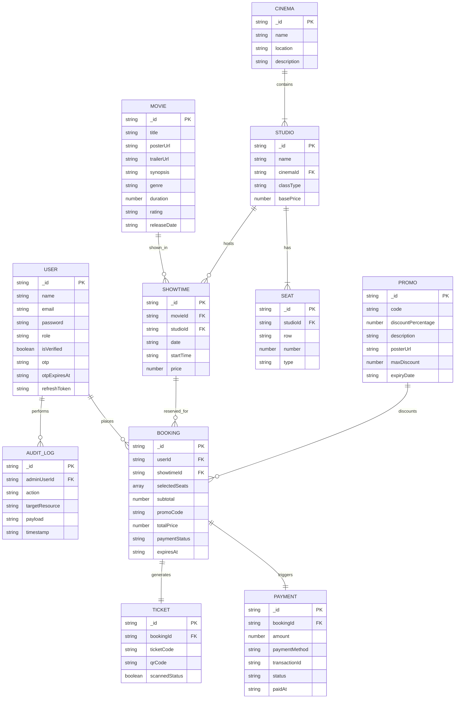

# Dokumentasi Teknis Aplikasi BioskopKu

BioskopKu adalah sistem aplikasi pemesanan tiket bioskop online modern yang dibangun dengan fokus pada arsitektur RESTful API, sinkronisasi real-time penuh, visual cinematic, dan keamanan data.

---

## 1. Arsitektur & Teknologi Sistem

Aplikasi ini menggunakan pola arsitektur **Client-Server** yang terpisah (Decoupled Monorepo) untuk memberikan skalabilitas dan responsivitas terbaik.

### Tech Stack
*   **Backend**: Node.js v22.20 + Express.js
*   **Database Engine**: MongoDB + Mongoose ORM
    *   *Dual-Mode Dynamic Proxy Adapter*: Otomatis beralih ke Local JSON File Database engine jika koneksi MongoDB lokal tidak terdeteksi (dengan toleransi timeout cepat 2 detik), sehingga aplikasi 100% siap dijalankan secara instan.
*   **Real-time Sync**: Socket.io (WebSockets) untuk sinkronisasi denah kursi, hot-reload daftar film, jadwal tayang, promo, dan dashboard admin langsung di semua role.
*   **Keamanan & Autentikasi**: JWT Access Token + Refresh Token rotation, hash password menggunakan Bcrypt, Rate Limiter OTP.
*   **Email Notification**: Resend Email API SDK (dengan fallback pencatatan log lokal pada `/backend/logs/otp.log`).
*   **Frontend**: React.js + Vite + Framer Motion (Full animation & transitions) + Lucide Icons (Strictly no emojis).
*   **QR Generator**: QRCode (Node/Client API).

---

## 2. Struktur Folder Project

```
tiket/
├── backend/
├── backend/
│   ├── config/
│   │   ├── db.js          # Dynamic Proxy Connection & JSON Mock database layer
│   │   ├── mailer.js      # Resend API & local file logger
│   │   └── seeder.js      # Programmatic seeder for 150+ movies (2026 releases)
│   ├── controllers/
│   │   ├── adminController.js
│   │   ├── authController.js
│   │   ├── bookingController.js
│   │   ├── cinemaController.js
│   │   └── movieController.js
│   ├── middleware/
│   │   └── auth.js        # JWT auth protection & RBAC middleware
│   ├── models/            # Mongoose / JSON collections schemas
│   ├── routes/
│   │   └── api.js         # API version 1 routers (/api/v1)
│   ├── logs/
│   │   └── otp.log        # Catatan lokal pengiriman OTP
│   └── server.js          # Server setup (HTTP, Socket.io, Express)
├── frontend/
│   ├── public/
│   └── src/
│       ├── assets/
│       ├── components/
│       │   ├── ConfirmationModal.jsx   # Centered Modern Confirmation Modal
│       │   ├── Navbar.jsx
│       │   ├── SkeletonCard.jsx        # Glowing loading shimmer skeleton
│       │   └── SplashScreen.jsx        # Opening animation cinematic
│       ├── pages/
│       │   ├── AdminPages.jsx          # Dashboard, CRUD, & Laporan Transaksi
│       │   ├── AuthPages.jsx           # Register, Verify OTP, Login, Recovery
│       │   └── UserPages.jsx           # Movie Catalog, Details, Seat Booking, Checkout, Tickets
│       ├── App.css
│       ├── App.jsx                     # Router config & protected route guards
│       ├── index.css                   # Custom cinematic design rules
│       └── main.jsx
├── package.json
├── bioskopku_mongodb.js                # Inisialisasi Database MongoDB (Query Shell)
└── README.md
```

---

## 3. Entity Relationship Diagram (ERD)

Diagram di bawah menunjukkan skema database relasional Mongoose yang diimplementasikan:



---

## 4. Alur Bisnis Aplikasi

### A. Registrasi & Verifikasi OTP
1. User mendaftar melalui form registrasi (Nama, Email, Password).
2. Sistem membuat record user dengan status `isVerified: false`, menghasilkan 6-digit kode OTP acak, dan menyimpannya beserta waktu kadaluarsa (10 menit).
3. Kode OTP dikirim ke email user via Resend (atau dicatat di console server & log lokal jika API Key kosong).
4. User diarahkan ke halaman verifikasi OTP untuk mengaktifkan akun. Setelah verifikasi sukses, status berubah menjadi `isVerified: true` dan user memperoleh token autentikasi.

### B. Pemesanan Kursi Real-Time
1. User memilih film, bioskop, tanggal, dan jadwal tayang yang diinginkan.
2. Saat masuk halaman denah kursi, client membuka koneksi WebSocket ke room `showtime_[id]`.
3. Ketika user memilih kursi:
    *   Sistem memancarkan event `seats-selecting` ke user lain di room yang sama untuk menandai kursi berwarna ungu (sedang ditinjau).
    *   Jika dilanjutkan ke checkout, kursi dikunci sementara selama 5 menit (`ExpiresAt` pada booking status `Pending`). Sistem memancarkan event `seats-locked` sehingga kursi menjadi merah dan tidak dapat dipilih user lain.
4. Jika transaksi diselesaikan (Paid), kursi dikunci permanen (`seats-sold`). Jika kadaluarsa (Expired), sistem otomatis melepas kunci kursi (`seats-released`) agar dapat dipesan kembali.

### C. Transaksi Pembayaran & E-Ticket
1. Di halaman Checkout, user dapat memasukkan kode promo (misal: `BIOSKOPKUSTART`). Potongan harga dihitung di backend secara aman.
2. User memilih metode pembayaran simulasi (E-Wallet, VA, dll) dan menekan bayar.
3. Setelah terverifikasi sukses:
    *   Status pemesanan diupdate menjadi `Paid`.
    *   Sistem membuat record `Payment` dengan kode transaksi unik.
    *   Sistem membuat record `Ticket` berisi `ticketCode` unik, detail tiket, dan menghasilkan file QR code (Data URL) yang merepresentasikan informasi pemesanan.
    *   Tiket digital dikirim via email. Halaman konfirmasi sukses merayakan dengan efek ledakan confetti.

---

## 5. Cara Menjalankan Project

### Prasyarat
*   Node.js v18 ke atas terpasang.
*   MongoDB terpasang (Opsional, server otomatis menggunakan File JSON Mock db jika tidak ada MongoDB).

### Cara Menjalankan Backend
1. Masuk ke root directory:
   ```bash
   npm install
   ```
2. Buat file `.env` di root folder (sudah kami buatkan default-nya):
   ```env
   PORT=5000
   MONGODB_URI=mongodb://127.0.0.1:27017/bioskopku
   JWT_ACCESS_SECRET=bioskopku_jwt_access_secret_key_2026_super_secure
   JWT_REFRESH_SECRET=bioskopku_jwt_refresh_secret_key_2026_super_secure
   RESEND_API_KEY=
   ```
3. Jalankan server:
   ```bash
   npm run server
   ```
   *Server akan berjalan di http://localhost:5000. Data awal (seperti akun admin admin@bioskopku.com/admin123 dan user@bioskopku.com/user123, 150+ film rilisan 2026, studio, kursi, dan kode promo) akan otomatis di-seed saat pertama kali server dinyalakan.*

### Cara Menjalankan Frontend
1. Masuk ke folder frontend dan jalankan:
   ```bash
   npm run dev
   ```
2. Aplikasi client berjalan di http://localhost:5173.

---

## 6. Pengujian & API Dokumentasi

Dokumentasi API lengkap dengan contoh Request Body, HTTP Status Code, dan Response JSON (Sukses & Gagal) untuk setiap endpoint dapat diakses pada berkas terpisah:
- **[Dokumentasi API Lengkap (API_DOCUMENTATION.md)](file:///c:/Users/rakba/Documents/tiket/API_DOCUMENTATION.md)**

### Postman Collection & Testing
Kami menyediakan berkas Postman Collection yang siap diimpor untuk melakukan pengujian otomatis/manual seluruh API:
- **[Postman Collection (TiketKu.postman_collection.json)](file:///c:/Users/rakba/Documents/tiket/TiketKu.postman_collection.json)**

### Daftar Endpoint Utama

| Kategori | Method | Endpoint | Proteksi | Fungsi |
|---|---|---|---|---|
| **Auth** | POST | `/api/v1/auth/register` | Publik | Mendaftarkan akun baru |
| | POST | `/api/v1/auth/verify-otp` | Publik | Memverifikasi OTP aktivasi akun |
| | POST | `/api/v1/auth/login` | Publik | Autentikasi user & generate JWT |
| | POST | `/api/v1/auth/forgot-password` | Publik | Request OTP ganti password |
| | POST | `/api/v1/auth/reset-password` | Publik | Mengganti password baru dengan OTP |
| | GET | `/api/v1/auth/profile` | Protected | Mendapatkan detail profil masuk |
| **Movies**| GET | `/api/v1/movies` | Publik | Daftar film (search/sort/page) |
| | POST | `/api/v1/movies` | Admin | Menambahkan film baru |
| **Cinema**| GET | `/api/v1/showtimes/:id` | Publik | Denah kursi & showtime detail |
| | POST | `/api/v1/showtimes` | Admin | Menjadwalkan film baru di studio |
| **Booking**| POST | `/api/v1/bookings` | Protected | Booking sementara & lock kursi |
| | POST | `/api/v1/payments/confirm`| Protected | Konfirmasi bayar & terbitkan tiket |
| | GET | `/api/v1/tickets/:bookingId`| Protected | Mengambil e-ticket beserta QR code |
| **Admin** | GET | `/api/v1/admin/dashboard`| Admin | Statistik dashboard & live logs |
| | GET | `/api/v1/admin/reports` | Admin | Laporan keuangan filter lengkap |

